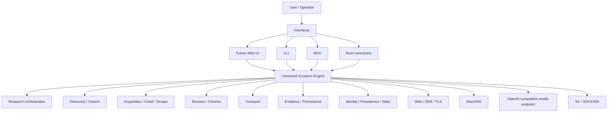
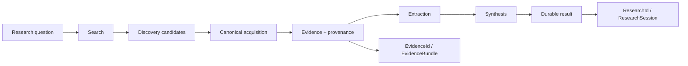

# Scorpion

Scorpion is an evidence-first Rust web research, crawling, acquisition, and
intelligence engine built on [Spider](https://github.com/spider-rs/spider).
It discovers sources, acquires and renders pages, preserves evidence, retains
provenance, and exposes the same canonical engine through a CLI, MCP, Rust
consumers, and (later) a web interface.

Scorpion is a fork of `spider-rs/spider`. Inherited crawler code, crate names,
imports, authorship, and MIT licensing remain attributed to Spider and its
contributors. Scorpion adds its canonical evidence, provenance, identity, and
research capabilities on top; it does not claim to have created the inherited
crawler.

## V1.0.0 status

Scorpion V1 is production-ready for the bounded engine envelope below. The
release is an engine and operator-facing toolkit, not a hosted search website.

| Surface | Status |
| --- | --- |
| Canonical HTTP acquisition, `Website::crawl`, `Website::scrape` | **PRODUCTION READY** |
| CLI crawl, scrape, fetch, download, research, and research show | **PRODUCTION READY** |
| MCP server (`spider-mcp` or `scorpion mcp`) | **PRODUCTION READY** |
| Chrome/browser acquisition | **PRODUCTION READY** |
| Evidence and provenance | **PRODUCTION READY** |
| Durable `ResearchSession` / `ResearchId` results | **PRODUCTION READY WITH CONFIGURATION** |
| Search and feed/sitemap/news/robots discovery | **SUPPORTED WITH CONFIGURATION** |
| Tor transport and canonical cache | **OPTIONAL / OPERATOR-CONFIGURED** |
| Challenge routing and local PaliGemma | **OPTIONAL** |
| Watch identity, state, scheduling primitives, and change detection | **FOUNDATION IMPLEMENTED** |
| Dedicated Scorpion Web/Search UI | **NOT IMPLEMENTED YET** |

There is currently no Google-like Scorpion search page. The engine exists; the
operator experience above it is the next implementation phase.

## Can I use Scorpion today?

Build the exact released V1 artifacts from source:

```sh
git clone https://github.com/Agentxx7/scorpion-rs.git
cd scorpion-rs
git checkout v1.0.0
cargo build --locked -p spider_cli -p spider_mcp
```

The release currently distributes source archives rather than prebuilt
executables. The resulting binaries are `target/debug/scorpion` and
`target/debug/spider-mcp` (use `--release` for optimized local artifacts).

Examples using the shipping `scorpion` binary:

```sh
scorpion --url https://example.com crawl --limit 1
scorpion --url https://example.com scrape
scorpion fetch https://example.com
scorpion --url https://example.com download --target-destination ./downloads
scorpion --url https://example.com --headless scrape
scorpion search --provider searxng --base-url http://127.0.0.1:8080 "rust async"
scorpion research "How do Tokio and async-std compare?" \
  --database ./research.sqlite \
  --searxng-url http://127.0.0.1:8080 \
  --openai-base-url http://127.0.0.1:1234/v1 \
  --model local-model
scorpion research show <RESEARCH_ID> --database ./research.sqlite
scorpion mcp
```

Run `scorpion --help` and `scorpion <command> --help` for the complete
shipping command surface.

## Local application API and search console

The post-V1 `scorpion-api` binary serves a minimal, local Search Console at `/`
and exposes `POST /api/search`. Both delegate to the same canonical SearXNG
provider used by Scorpion; provider metadata, credentials, and local paths are
not part of the public response. It binds to `127.0.0.1:8787` by default and
reads the operator-owned `SEARXNG_BASE_URL`.

```sh
SEARXNG_BASE_URL=http://127.0.0.1:8080 target/debug/scorpion-api
curl -sS -X POST http://127.0.0.1:8787/api/search \
  -H 'content-type: application/json' \
  -d '{"query":"rust async","limit":5}'
```

Open `http://127.0.0.1:8787/` in a browser to use the Search Console. It is
Search/discovery only: research, accounts, authentication, evidence inspection,
and progress streaming are not implemented here.

## Search today

Search is a real canonical capability, but Scorpion is not itself a public
search-index provider. The flow is:

```text
user query → Scorpion search → operator-provided SearXNG → discovery candidates
```

The search command returns candidates as JSON; it does **not** fetch those
result pages. Acquisition is a separate canonical step (`fetch`, `crawl`, or
`scrape`).

## Research today

Durable research requires a database, SearXNG, and an OpenAI-compatible model
endpoint. A research question is searched, selected sources are acquired
through the canonical evidence path, extracted, synthesized, and persisted.

```text
Research question → Search → candidates → acquisition → evidence
                  → extraction → synthesis → durable result
```

The durable lineage is:

```text
ResearchId → ResearchSession → DurableResearchResult
           → Source N + EvidenceRef → EvidenceId → EvidenceBundle
```

In plain terms, a `ResearchId` reopens one persisted invocation, while each
`EvidenceId` identifies durable source evidence behind its citations. V1 does
not claim deterministic replay or complete request snapshots.

## Architecture

The rule is **one canonical engine, multiple thin interfaces**. A future web
console must call these same seams; it must not grow a second crawler, search
engine, transport, research implementation, evidence store, or persistence
system.



### Research flow



## Proof-gated development

AI may propose and implement changes, but AI is not the authority that a
capability works. Scorpion narrows every claim to evidence:

```text
architecture contract → implementation → TDD → guardrails
→ shipping-binary tests → adversarial failures → production reality
→ exact-SHA CI → release gate
```

Green unit tests alone do not mean `CLOSED`. The project checks that code
exists, the real shipping path reaches it, failures cannot become false
success, provenance remains truthful, the exact commit passed CI, and required
external behavior was observed. See [SCORPION_PROCESS.md](./SCORPION_PROCESS.md),
[SCORPION_ARCHITECTURE.md](./SCORPION_ARCHITECTURE.md), and
[docs/INTELLIGENT_FAILURE.md](./docs/INTELLIGENT_FAILURE.md).

## V1 production reality

The exact released SHA is `6c7253b8c3f7a4073975dc5cdc25a6572e2113e7`.
Production Reality run [33144608097](https://github.com/Agentxx7/scorpion-rs/actions/runs/33144608097)
executed **17/17 required cases with zero skips**. It proved public DNS,
valid TLS, invalid-certificate rejection, redirects, remote 404/500, NXDOMAIN,
Website crawl and scrape, CLI crawl/scrape/download/fetch, external MCP HTTPS
and failure behavior, real external Chrome with JavaScript rendering, truthful
evidence/provenance, and false-success protection. Release workflow run
[33146075800](https://github.com/Agentxx7/scorpion-rs/actions/runs/33146075800)
created tag `v1.0.0` only after the exact build and security gates passed.

## Known limitations

- There is no dedicated Scorpion Web/Search UI yet.
- Search requires an operator-provided SearXNG endpoint.
- Durable research requires a configured database, SearXNG, and
  OpenAI-compatible model endpoint.
- HTTP/2 is not a V1 protocol guarantee.
- Real Chrome/CDP acquisitions may truthfully expose `BackendProvenance = None`
  and `ResponseOrigin = None` when the model cannot identify an HTTP backend.
- Tor requires operator-provided SOCKS5h/Tor infrastructure.
- Local PaliGemma is optional and bounded by its pinned model, hardware, and
  supported challenge-family contract. Scorpion does not promise general
  third-party CAPTCHA bypass.
- Canonical cache is optional.
- `wreq`, decentralized, memvid/full-agent, `spider_worker`, experimental
  backend combinations, and direct/internal Chrome APIs are excluded from the
  V1 production-ready declaration.
- V1 currently distributes source/build instructions rather than prebuilt
  binaries.

## Public roadmap

### Phase 1 — Released now

V1.0.0 provides crawl, scrape, fetch, download, CLI, MCP, Chrome, SearXNG
search, durable research, evidence/provenance, challenge routing, cache and
Tor boundaries, plus release/security/production-reality assurance.

### Phase 2 — Next priority: visible operator experience

Build a thin Scorpion Web Console / Search UI where a person can type a
question and see discovery, source selection, live acquisition progress,
research synthesis, evidence/provenance inspection, `ResearchId` reopening,
and failures. Pair it with a minimal SearXNG/database/model quick start and a
stable public JSON research CLI contract. The console will remain an interface
over the canonical engine.

### Phase 3 — Research depth

Deterministic replay and complete search/model request snapshots, adaptive
focused crawling, richer browser/DOM/network traces, first-class non-HTML
evidence, and richer research/discovery lineage.

### Phase 4 — Monitoring

Watch identity, state, scheduled execution primitives, change detection, and
health/readiness exist today. A background scheduler daemon, notifications,
and operator UI remain future work.

### Phase 5 — Network and distribution expansion

Potential future directions include mixed clearweb/`.onion` orchestration and
packaging improvements, including prebuilt release artifacts where appropriate.
No dates or uncommitted version promises are made.

## Documentation hierarchy

- [SCORPION.md](./SCORPION.md) — public product contract
- [SCORPION_ARCHITECTURE.md](./SCORPION_ARCHITECTURE.md) — canonical ownership and architecture truth
- [SCORPION_SDD.md](./SCORPION_SDD.md) — design specification
- [SCORPION_PROCESS.md](./SCORPION_PROCESS.md) — frontier and verification process
- [docs/INTELLIGENT_FAILURE.md](./docs/INTELLIGENT_FAILURE.md) — AI/TDD/product-confidence lessons
- [CLI guide](./spider_cli/README.md)

## Upstream and license

For inherited Spider APIs, packages, and managed service, see the
[Spider repository](https://github.com/spider-rs/spider),
[Spider crate](https://crates.io/crates/spider), [docs.rs](https://docs.rs/spider),
and [Spider Cloud](https://spider.cloud). Spider Cloud is optional; Scorpion
core remains self-hostable. The repository retains Spider's MIT license and
attribution.
